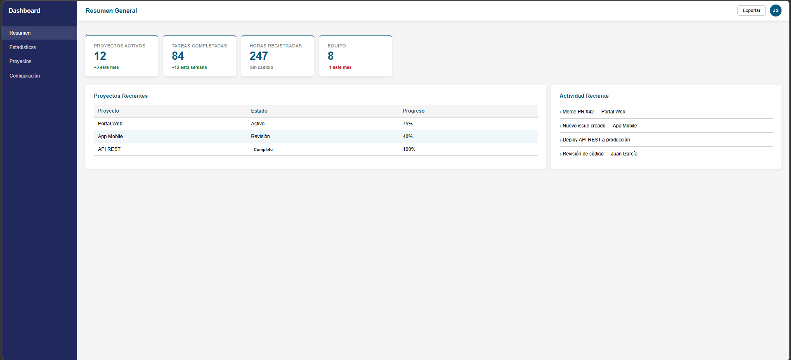
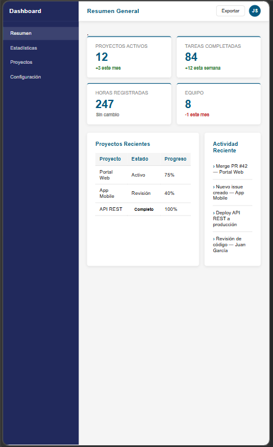

# Dashboard Web - PostContenido U3

## Autor
**Sergio Andrés Moreno Sánchez**  
Estudiante de Ingeniería de Sistemas - Universidad de Santander (UDES)

---

## Descripción
Este proyecto corresponde al laboratorio de la Unidad 3 de Programación Web (CSS3 Básico).  
Se implementa un **dashboard responsivo** aplicando:

- **CSS Grid** para la estructura principal de la aplicación (sidebar, topbar, main).  
- **Flexbox** para la distribución interna de componentes (sidebar, topbar, tarjetas).  
- Custom Properties y reset global para mantener consistencia en estilos.  

El resultado es un dashboard con navegación lateral, barra superior, tarjetas de estadísticas y paneles de contenido.

---

## Instrucciones de ejecución
1. Clonar o descargar este repositorio:
   ```bash
   git clone https://github.com/tuusuario/moreno-post2-u3.git




